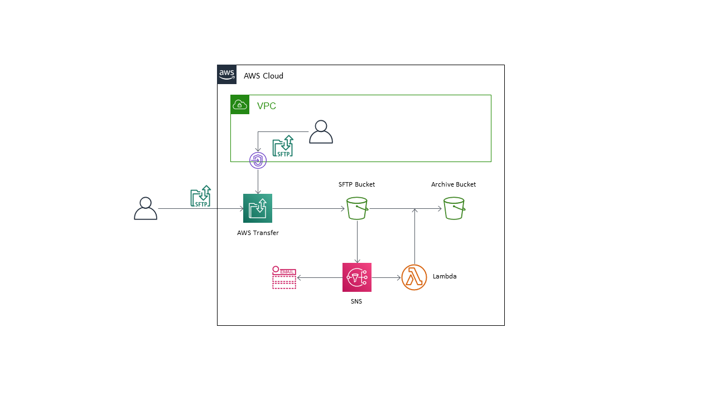

# AWS CDK AWS Transfer SFTP Server Demo

This Typescript CDK project creates an AWS Transfer SFTP Server with test users and S3 notifications.

&nbsp;

The SFTP server can optionally use a custom hostname and certificate, or you can test using the default server name.

Optionally it can import a custom Host Key to the server from Secrets Manager. This is used for migrating from an existing server or to allow the use of the same key across clusters or regions.

This Readme assumes you already have an understanding of CDK deployments.

You can deploy the stacks using CDK Deploy.

A more detailed explanation is available [in this Medium article](https://markilott.medium.com/aws-transfer-sftp-with-cdk-and-custom-ssh-host-key-10e4cb98816c?sk=8d3fab350a9d5f0d8b50fa66f4558eb1).

&nbsp;

## Requirements

- The demo uses the AWS default VPC by default, but you can also use your own. The VPC must have public subnets.
- Route53 domain if you want to use a custom hostname. The Route53 Zone must be in the same Account.

&nbsp;

## Setup

Assuming you have the AWS CLI and CDK installed and configured already...

Setup the project:
- Clone the repo
- run `npm install`
- Update the `config/index.ts` file with your own environment details and preferences

&nbsp;

## Options

- `vpcId` - leave blank to use the default VPC, or enter your own VPC Id.
- `sftpAttr`
  - `moveToArchive` - enable/disable the move to archive function.
  - `allowCidrs` - a list of CIDR ranges to allow. If blank the server will allow all.
- `customHostname` - use a custom domain and hostname for the server. If true you will also need to enter the hostname and hostedZoneId for the Route53 zone.
  - `certificateArn` - we can create a new certificate for the custom hostname, or you can use an existing certificate. Must be a wildcard and in the same region.
  - `dnsAttr` - the `zoneName` and `hostedZoneId` for a Route53 domain in the same account
- `useCustomHostKey` - import a custom Private key for the server from Secrets Manager. Must be a base64 encoded private key stored as plain text in the Secret
  - `hostKeySecretArn` - the full Arn of the Secret which you have previously created.
  - `hostKeyVersion` - used to update the host key if you want to change it. Update the key in Secrets Manager, then modify this field to update.
- `users` - enter at least one user so you can test the server. You will need to create a public/private key pair and copy the public key here. On Windows copy the public key from the PuttyGen window, the format in the saved text files won't work.
- `notificationEmails` - enter an email address here if you want to test notifications. You will receive a verification notice from SNS on deployment.

&nbsp;

## Deployment

Use CDK to deploy:
`cdk deploy`

Note we are using Lookups for the VPC and domain here. You will need to be authenticated to the correct Account in the CLI before you can run `cdk diff` or `cdk synth` the first time. After that the VPC info is saved in cdk.context and you can run offline.

&nbsp;

## Testing and Updating

The server hostname will be Output on deployment and available publicly.

The server is also connected to the VPC for internal use but that is more complicated to access and test - you can look up the DNS address on the VPC Endpoint (a network load balancer is required if you want a friendly hostname internally - a project for later).

Use your favourite SFTP client to upload some files. You should see them moved almost instantly from the upload bucket to the archive bucket (if you have `moveToArchive` enabled).

&nbsp;

## Costs and Cleanup

AWS Transfer is expensive at ~$200/month - don't leave it running after testing!

Use `cdk destroy` or delete the CloudFormation stacks.
